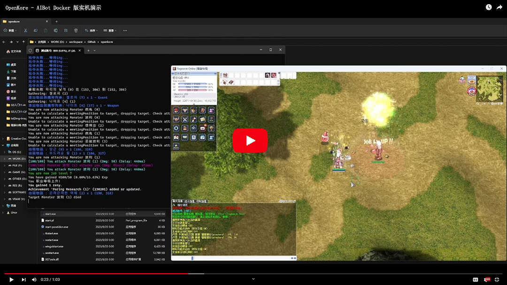

# openkore-docker

> docker 一键部署 openkore RO Bot

------


## 概要

OpenKore 和传统的 RO Bot 不同，它是纯命令行交互、没有 UI 界面，而且支持多平台运行，这就为容器化提供了基础支持。

但因为 OpenKore 的安装依赖大部分都是系统基础依赖，导致与用户环境兼容性的问题突出，解决这些问题本身比安装过程更为繁琐。

而容器化就是目前最好的解决方案。

- 官方 [源码](https://github.com/OpenKore/openkore)
- 官方 [wiki](https://openkore.com/wiki/Main_Page) 
- 官方 [论坛](https://forums.openkore.com/)

[](https://www.bilibili.com/video/BV14w411Y78k)

<details>
<summary><b>更多实机展示</b></summary>
<br/>


</details>


## 目录结构说明

```
openkore-docker
├── LICENSE
├── imgs
├── README.md
├── bin
│   ├── build.ps1
│   ├── build.sh
│   ├── clean.ps1
│   ├── clean.sh
│   ├── deploy.ps1
│   ├── deploy.sh
│   ├── run.ps1
│   ├── run.sh
│   ├── stop.ps1
│   ├── stop.sh
│   ├── terminal.ps1
│   ├── terminal.sh
│   ├── to_sha256.ps1
│   └── to_sha256.sh
├── openkore
├── Dockerfile
├── docker-compose.yml
└── volumes
    ├── bin
    ├── compile.exp
    ├── openkore
    │   ├── README.md
    │   └── tables
    │       └── demo.servers.txt
    └── readlinetest.c
mstream-docker
├── music ....................... [音乐文件只要放到此目录下即可被识别，支持多目录嵌套]
├── config ...................... [mStream 配置目录]
├── docker-compose.yml .......... [mStream 镜像构建脚本]
├── run.sh ...................... [mStream 服务一键启动脚本]
├── stop.sh ..................... [mStream 服务一键停止脚本]
├── imgs ........................ [README 插图目录]
└── README.md ................... [本仓库说明文档]
```

## 环境要求

  


## 部署步骤

### 1. 项目构建

- 宿主机安装 docker、docker-compose
- 下载仓库： `git clone https://github.com/Casual-Ragnarok/openkore-docker`
- 打开仓库目录： `cd openkore-docker`
- 构建镜像： `./build.sh|ps1`


### 设置服务器配置


### 终端运行


多号运行：
https://forums.openkore.com/viewtopic.php?t=15802
https://ro.private-servers-game.com/forum.php?mod=viewthread&tid=904

perl ./openkore.pl


# peek 中获取的密钥按以下顺序使用：
# sendCryptKeys 1, 3, 2
# https://openkore.com/wiki/Connectivity_Guide
# https://forums.openkore.com/viewtopic.php?t=212793


https://ragnabotko.blogspot.com/2011/09/how-to-run-openkore-to-your-ubuntu.html
https://openkore.com/wiki/How_to_run_OpenKore


https://openkore.com/wiki/Main_Page
https://openkore.com/wiki/Connectivity_Guide
https://forums.openkore.com/viewtopic.php?t=212793


https://openkore.com/wiki/Packet_Length_Extractor
https://misc.openkore.com/


perl ./openkore.pl --control="/app/accounts/A0000/"
perl ./openkore.pl --config="/app/accounts/A0001/config.txt"


git remote set-url git@ro.github.com:Casual-Ragnarok/openkore-docker.git