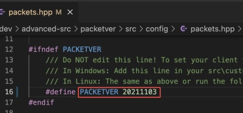

# 服务器连接配置

------

在 openkore/tables/servers.txt（挂载目录为 volumes/openkore/control）下主要配置了所有 RO 服务器连接信息。


每一个服务器配置的[完整配置模板](https://openkore.com/wiki/Connectivity_Guide#Configuring_Openkore)如下：

```
[<server name>]
ip <number/host>
port <number>
version <number>
master_version <number> 
serverType <serverType name>
serverEncoding <encoding>
charBlockSize <number>
addTableFolders <folder path>

# following options are optional
private <boolean>
recvpackets <file name>
chatLangCode <boolean>
storageEncryptKey <encrypt key>
field_<location> <filename>
clientHash <hex string>
captcha <boolean>

gameGuard <number>

secureLogin <boolean>
secureLogin_type <type>
secureLogin_requestCode <hex string>
secureLogin_account <boolean>

preLoginCode <boolean>

paddedPackets <boolean>
paddedPackets_attackID <packet switches>
paddedPackets_skillUseID <packet switches>

masterLogin_packet <packet switch>

OTP_ip <IP_or_hosthame>
OTP_port <number>

dead <boolean>
dead_message <any text>
title <any text>

pinCode <boolean>
charDeleteDateType <boolean>
blockingPlayerCancel <boolean>
rankingSystemType <boolean>
itemListType <boolean>
ignoreAntiCheatWarning <boolean>
```

例如对于 PACKETVER = 20211103 的 rAthena 服务端，其服务器连接配置就是:

```
[z_YourRO - xxxxxx]
ip ${Your_Server_Public_IP}
port 6900
master_version 1
version 28
serverType kRO_RagexeRE_2021_11_03
serverEncoding GBK
gameGuard 0
storageEncryptKey 0x050B6F79, 0x0202C179, 0x00E20120, 0x04FA43E3, 0x0179B6C8, 0x05973DF2, 0x007D8D6B, 0x08CB9ED9
addTableFolders kRO/Ragexe_2021_11_03;iRO
charBlockSize 175
pinCode 0
charDeleteDateType 1
rankingSystemType 1
private 1
# sendCryptKeys ${PACKET_OBFUSCATION_KEY1},{PACKET_OBFUSCATION_KEY3},{PACKET_OBFUSCATION_KEY2}
```

## 0x10 必填选项

### 0x11 server name

服务配置的名称，名字可任意设定，这个名字在连接时、会出现在服务器选单中。由于选单是按字母序排序的，故其首字母可以控制这份服务器配置在选单中出现的位置。


> 尽量避免更改已存在的服务名称，以免破坏已存在的配置。建议可以新增一条服务配置记录。


### 0x12 ip

需要登录的 RO 服务器 IP，又分几种情况：

- 本地提供服务（docker 服务暴露到宿主机也算）: 固定值 host.docker.internal
- docker 内提供服务（没有暴露到宿主机）: 该服务需要使用 [docker-compose.yml](./docker-compose.yml) 的网段，并指定任意一个 IP
- 局域网提供服务: 配置为局域网的 IP
- 云主机提供服务: 配置为云主机的公网 IP
- 通过反向代理提供服务: 配置为代理的公网 IP

> `127.0.0.1` 是 openkore-docker 容器本地的 IP，除非用这个仓库作为基础镜像搭建 RO 服务端，不然不论哪种情况都不应配置为 `127.0.0.1`


### 0x13 port

需要登录的 RO 服务器端口，默认是 6900，非必要不需要改。


### 0x14 version 和 master_version

根据[官方](https://openkore.com/wiki/Connectivity_Guide)的介绍，这两个值需要通过 WPE 或 Wireshark 抓取封包获得，以 [WPE](https://docs.ragnarok.buzz/01-developer/02-tools/WPE_v3.0.zip) 为例：

运行 RO 客户端 ragnarok.exe，但是停在输入帐密的界面，不要登录。然后运行 WPE，点击 Target Programs 按钮：


找到 ragnarok.exe 并双击选中为抓包目标（部分补丁可能改过进程名，如: xxxRO.exe、xxxx.dll、xxxxx.bin 等，按实际选择即可）


点击 WPE 的抓包按钮，然后切换到 RO 的登录界面登录，在输入框随便输入帐密（可以不正确）、点击登录


再切换到 WPE ，点击停止抓包按钮：


此时可以看到刚才登录时抓到的包：


如上图这个发送出去的封包（可以看到 RO 登录帐密是明文传输的，没有做加密处理），其中：

1. 对应 `version`，需要按照小端序（little-endian）将这 4 个十六进制数重新排列。这里为 `14 00 00 00`，小端序就是从有到左倒过来 `00 00 00 14`，转成十进制就是 `20`
2. 对应 `ip`，RO 登录服务 IP，如果前面配 IP 不知道取什么值，可以在这里获取
3. 对应 `port`，RO 登录服务端口，如果前面配端口知道取什么值，可以在这里获取
4. 对应 `master_version`，固定是最后 1 个十六进制数，这里为 `10`，转成十进制就是 `2`

> 事实上只有官服才会校验版本，实测在 rAthena 系列中配置为任意值都会不影响 openkore 登录。


### 0x15 serverType

服务器类型。每个官服都有自己的服务器类型，rAthena 必须根据可执行文件的编译日期使用 kRO 服务器类型，而且还需要 openkore 支持。

根据[官方说明](https://openkore.com/wiki/serverType#kRO_serverTypes_for_private_servers)，rAthena 私服的固定格式为：

```
kRO_RagexeRE_<year>_<month>_<date><letter>
```

官方提供了一张[枚举表](https://openkore.com/wiki/serverType#Server_Version)，建议通过 [PEViewer](https://docs.ragnarok.buzz/01-developer/02-tools/PEViewer.zip) 等工具查看 ragnarok.exe 文件头中的编译日期、然后根据日期查表获得对应的的 serverType。


但是枚举表更新有延迟，通过 [github issue](https://github.com/OpenKore/openkore/issues/3792) 得知，目前 openkore 支持 kRO 最新的版本是 2021-11-03，对应网络文件是 `./openkore/src/Network/Receive/kRO/RagexeRE_2021_11_03.pm`、包解码文件是 `openkore/tables/kRO/Ragexe_2021_11_03/recvpackets.txt`。

对应 rAthena 的 PACKETVER 也是 20211103:



> RO 服务器发送给客户端的网络数据是一个字节流，openkore 必须能够识别字节流中的消息才能对其进行处理。但是每条消息的大小可能因服务器而异，recvpackets.txt 则包含了每条消息的大小信息，以便 openkore 可以正确地将字节流拆分成消息。recvpackets.txt 的生成方式详见官方[说明](https://openkore.com/wiki/Packet_Length_Extractor)。


如果 serverType 配置不当，可能会出现以下异常：

- Packet Tokenizer: Unknown switch: xxxx
- 几秒钟后断开连接
- openkore 无法识别 NPC、玩家和怪物（显示为未知）

此时需要利用 Packet Extractor 或 JCV's RO Tools 生成对应的 recvpackets 后、再配置其 serverType。

> 实测 serverType = kRO_RagexeRE_2021_11_03 时，依然能兼容 PACKETVER = 20211117 版本的包解码。


### 0x16 serverEncoding

服务端使用的编码，编码列表可以在[这里]选择。如果发现连接后乱码，需要变更编码配置。

一般中文搭建的 rAthena 服务端都是 GBK 编码。


### 0x17 charBlockSize

在角色选择界面上，用于描述每个字符的数据块（received_characters）的长度（以字节为单位）。

这个值每个版本迭代都可能会变化，因为它的来源就是 rAthena 源码中 mmo_char_tobuf 所生成的结构体的块大小，但是这个大小在不同版本中都是动态不固定的。

一般的服务器运营者很难获取到这个值，即使是运维人员、甚至是开发人员也不好获取。

官方有在维护一张各个版本的[枚举值表](https://openkore.com/wiki/charBlockSize)，但是因为有人在[论坛](https://forums.openkore.com/viewtopic.php?t=9806)里面建议 openkore 自动获得这个值，所以目前这个值已经处于半弃用状态了。

20211117 版本的 rAthena 可以配置为最后一个枚举值 175。


### 0x18 addTableFolders

当 openkore 的启动命令行没有声明 `--tables` 参数时，使用这个选项的值做默认配置。

对于 rAthena 搭建的服务器，一般配置为 `addTableFolders kRO/Ragexe_2021_11_03;iRO`

其中 `;` 是指添加了两个目录，openkore 会按照给出的顺序加载目标文件夹，如果有重复的文件名，只有首先加载的文件生效。

在这个例子中，`kRO/Ragexe_2021_11_03` 和 `iRO` 两个文件夹中都有 `recvpackets.txt`，那么 openkore 会优先使用 kRO 中的文件。

> 为了使这些设置生效，这些文件夹必须存在于 openkore 的 `tables` 目录下。但是由于 docker 没有暴露这些文件夹到主机，所以 volumes 目录下看不到，可以通过 `bin/terminal.sh|ps1` 进入容器找到这些目录。


## 0x20 可选选项

### 0x21 sendCryptKeys

官方没有针对这个配置做说明，是一个隐藏选项。

当服务端采用[封包加密](https://exp-blog.com/game/ro/cong-ling-kai-shi-diff-ragnarok-deng-ru-qi-jiao-cheng)通信时，服务端或者客户端都会依次设置 3 个密钥，例如: `0a19cadf`, `393a136d`, `270c507c`：


此时 openkore 需要设置 sendCryptKeys 才能连接到服务端，而[密钥顺序](https://forums.openkore.com/viewtopic.php?t=212793)需要配置为 `1, 3, 2`，例如这个例子：

```
sendCryptKeys 0a19cadf, 270c507c, 393a136d
```


### 0x22 private

如果 openkore 连接到地图服务器报错，则可以启用这个选项。

rAthena 搭建的私服一般设置为 `1`。


### 0x23 recvpackets

指定 recvpackets.txt 的文件名，非必要不修改，使用默认就好。


### 0x24 chatLangCode

启用聊天消息中的语言代码支持（一个管道和两个十六进制数字），一般不设置。

例如有 1 条聊天消息为： `Hello, xxx|01`， 最后的 `|01` 就是语言代码。

但是 openkore 并没有给出语言代码的枚举表，所以实际上这个选项没有意义。


### 0x25 storageEncryptKey

指定服务器的存储加密密钥，用于加解密数据包。

这个值官方没有提及怎么获取，估计是逆向得到的。

在将来可能会发生变化，但是目前固定值为 `0x050B6F79, 0x0202C179, 0x00E20120, 0x04FA43E3, 0x0179B6C8, 0x05973DF2, 0x007D8D6B, 0x08CB9ED9`。


### 0x26 field_`<location>`

这个选项用于设置地图别名，例如： `field_morocc morocc-old`

如果你的服务器使用过时或修改过的地图数据，它将非常有用。


### 0x27 clientHash

在 rAthena 的服务端 login_athena.conf 配置中，可以通过启用 client_hash_check 验证客户端 exe 文件的 MD5 指纹避免恶意玩家篡改登陆器登录：


此时 openkore 可以通过设置 clientHash 伪造指纹，绕过这个识别机制。

但是对于同时使用 rAthena 搭建、又通过 openkore 的做机器人的服主，建议在 rAthena 开启 client_hash_check 的同时，设置 client_hash 的 group_id 策略，如上图例子：

- 对于 `group_id = 0, 1` 的正常玩家做 clientHash 指纹校验
- 对于 `group_id = 97` 的机器人玩家不做校验
- 对于 `group_id = 98, 99` 的 GM 不做校验

这样 openkore 就不需要设置 clientHash，而且还能区分机器人和正常玩家、进行统一管理。


### 0x28 captcha

验证码的应用场景可以参考[官方例子](https://openkore.com/wiki/captcha)。

当开启这个选项时，挂机过程中一旦 openkore 被反外挂程序识别出来并要求填写验证码时：

- 验证码的图片会自动下载到**日志目录** [`logs`](../../../logs)
- 人工查阅验证码图片
- 在 openkore 的控制台手动输入验证码


### 0x29 gameGuard

服务器是否启用了反外挂。

此选项在配置 [Poseidon](https://openkore.com/wiki/Poseidon) 代理时才有用，一般情况下，rAthena 搭建的服务器、其客户端在 [DIFF](https://exp-blog.com/game/ro/cong-ling-kai-shi-diff-ragnarok-deng-ru-qi-jiao-cheng/) 的时候都会去掉反外挂，因此固定配置 `gameGuard 0` 即可。


### 0x2A secureLogin

关于 [`secureLogin**`](https://openkore.com/wiki/secureLogin) 官方已有[详细解释](https://openkore.com/wiki/secureLogin)，这四个选项一般只有在连接官服的时候才有用，rAthena 搭建的服务器用不到。

就效果来说，这四个选项是为了让 OpenKore 能够以加密的方式进行保护账户信息的登录过程，这里大概说明一下：

1. secureLogin: 这个选项定义了登录时所使用的数据包类型。具体值和对应的数据包包含：
    - 0：不使用安全登录模式，登录时使用 `0064` 标识的 master_login 登录行为
    - 1：登录时使用 `01DD` 标识的 master_login 登录行为
    - 3：登录时使用 `01FA` 标识的 master_login 登录行为

在 RO 中，每当有一项操作需要在服务器和客户端之间进行交互（如登录游戏，移动角色等），都会有一个特定的数据包被发送，这些标识符决定了数据包的功能和它们的格式结构。因此这里不管是 `01DD` 还是 `01FA`，都是 RO 服务端和客户端之间加密通信的标识符，区别只是两者的预设值不同、决定了后续发送数据包的类型和内容也不同。

2. secureLogin_type: 当 `secureLogin = 1 or 3` 时，选择发送数据包的内容：
    - 0：不使用标准类型的数据包
    - 1：标准数据包 `04 02 7B 8A A8 90 2F D8 E8 30 F8 A5 25 7A 0D 3B CE 52`
    - 2：标准数据包 `04 02 27 6A 2C CE AF 88 01 87 CB B1 FC D5 90 C4 ED D2`
    - 3：标准数据包 `04 02 42 00 B0 CA 10 49 3D 89 49 42 82 57 B1 68 5B 85`
    - 4：标准数据包 `04 02 22 37 D7 FC 8E 9B 05 79 60 AE 02 33 6D 0D 82 C6`
    - 5：标准数据包 `04 02 C7 0A 94 C2 7A CC 38 9A 47 F5 54 39 7C A4 D0 39`
3. secureLogin_requestCode: 当需要自定义数据包内容时，则令 `secureLogin_type = 0`，然后在 secureLogin_requestCode 指定任何值即可（必须是以空格分隔的十六进制代码序列）
4. secureLogin_account: 当且仅当 `secureLogin = 3` 时才有用，但是官方没有提有什么用。


### 0x2B preLoginCode

如果你的服务在 master_login 登录前发送了一个数据包，此选项应该设置为 `1`。 但是目前没有任何地方用到这个选项。

> master_login 就是指客户端输入帐密登录的那个界面的登录行为


### 0x2C masterLogin_packet

覆盖 master_login 数据包（但不改变其结构）。

如果与 `0064` 标识不同，则需要使用 [XKore](https://openkore.com/wiki/XKore) 模式 2（hook）的部署架构。


### 0x2D paddedPackets

官方没有关于 paddedPackets、paddedPackets_attackID 和 paddedPackets_skillUseID 的选项说明。


### 0x2E OTP_ip 和 OTP_port

含有一次性登录密码的登录服务 IP 和 端口。


### 0x2F dead 和 dead_message

如果 `dead = 1`，表示该服务器已经停止服务，使用 openkore 连接时不会出现在服务器清单中。

如果存在 config.txt 引用了这种服务器，则会抛出 `dead_message` 定义的异常信息。


### 0x2G title

单纯改变 `[<server name>]` 在列表中显示的名称，但是 config.txt 记录的名称依然是 `[<server name>]` 设定的名称，列表排序还是按照 `[<server name>]` 的字典序。

是当想修改服务器名称又不想令已有配置异常时，这个选项很有用。


### 0x2H pinCode

当 RO 服务器需要使用 PIN 码登录时，此选项需要设置为 `1`。


### 0x2I charDeleteDateType

当 RO 服务器需要使用当前日期和时间来删除人物角色时，此选项需要设置为 `1`。


### 0x2J blockingPlayerCancel

当 RO 服务器需要客户端发送 blocking_player_cancel （`0447` 标识的数据包）时，此选项需要设置为 `1`。

> 仅在 [XKore](https://openkore.com/wiki/XKore) 部署架构为模式 1 时无效


### 0x2K rankingSystemType

当 RO 服务器使用 rank_general（通用排名），而非 rank_killer（刺客排名）、rank_taekwon（跆拳道排名）、rank_alchemist（炼金术士排名）、rank_blacksmith（铁匠排名）时，此选项需要设置为 `1`。


### 0x2L itemListType

如果 RO 服务器使用 `0B08 ~ 0B0B` 的 item_list 数据包、而非使用了常规的 item 数据包，此选项需要设置为 `1`。

一个判断方法是，如果使用了非常规的 item 数据包，会报错 `Unknown switch: xxxx`（`xxxx` 为 `0B08 ~ 0B0B` 之间的任何多个值），而且无法使用背包和仓库道具，详见[这个 issue](https://github.com/OpenKore/openkore/issues/2998)。


### 0x2M itemListUseOldType

在 item_list 中支持历史版本的道具类型，相关 [issue](https://github.com/OpenKore/openkore/pull/3700)


### 0x2N ignoreAntiCheatWarning

如果启用此选项，则禁用所有反作弊警告。

当前仅适用于 EAC(Easy Anti-Cheat) 反作弊系统。
